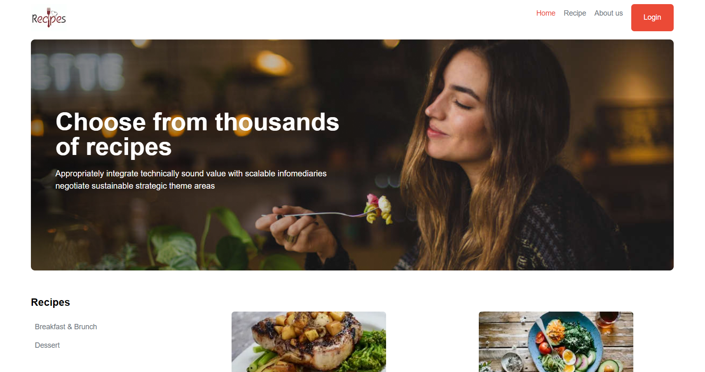
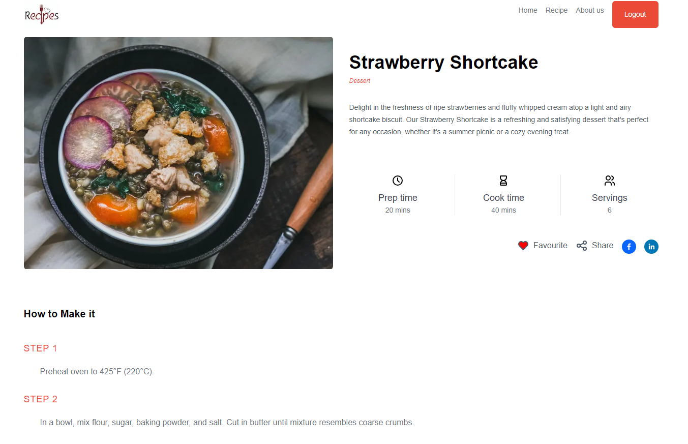
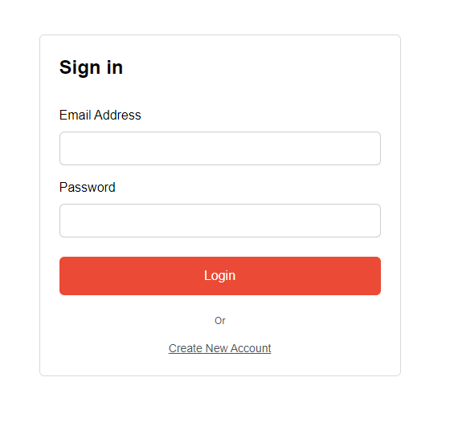
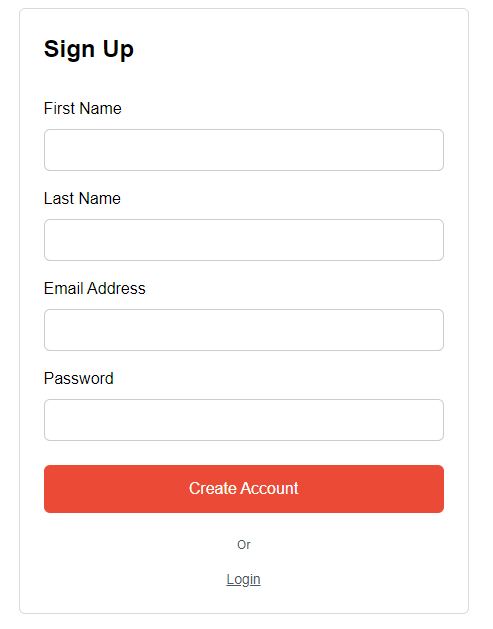
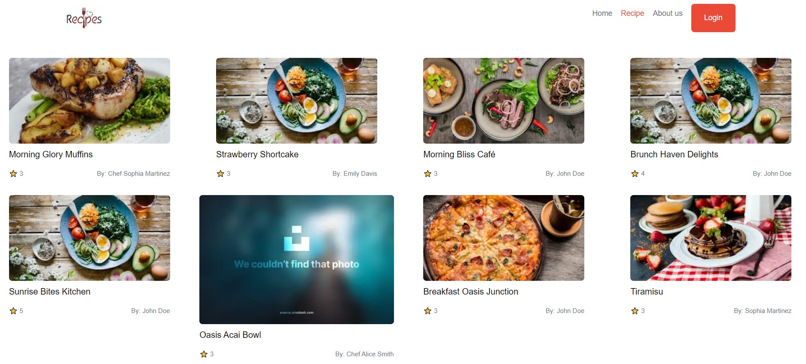
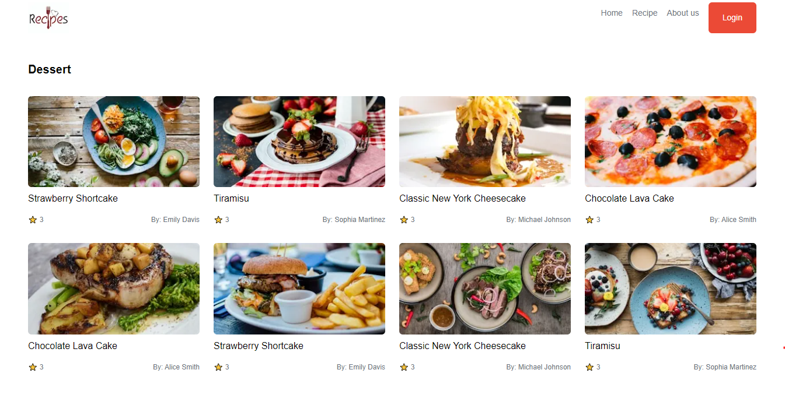
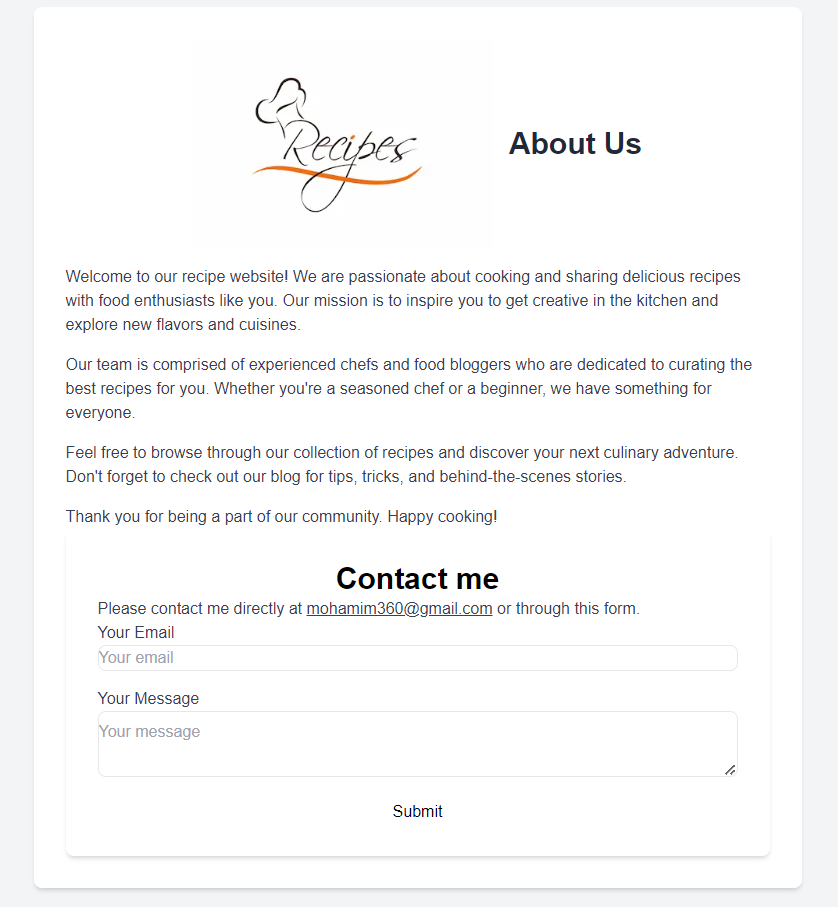

# KhanaKhazana Recipe Website

Welcome to KhanaKhazana, your go-to destination for exploring and sharing delicious recipes!

## Table of Contents
1. [Introduction](#introduction)
2. [Features](#features)
3. [Pages](#pages)
   - [Home Page](#home-page)
   - [Details Page](#details-page)
   - [Login and Register](#login-and-register)
   - [Recipe Page](#recipe-page)
   - [Category Page](#category-page)
	- [About Page](#about-page)
4. [Getting Started](#getting-started)
5. [Technologies Used](#technologies-used)

---

## Introduction
KhanaKhazana is a recipe website designed to inspire cooking enthusiasts with a wide range of recipes from different cuisines. Whether you're a seasoned chef or a beginner, you'll find something to satisfy your culinary cravings.

## Features
- SEO-friendly home page with server-side rendering for optimal performance.
- User authentication system for secure login and registration.
- Detailed recipe cards with the ability to view recipe details.
- Categorized recipes for easy navigation and exploration.
- Favorite button to save recipes for logged-in users.
- Social media sharing functionality to share recipes with friends and family.
- Properly updated metadata for improved search engine visibility.

---

## Pages

### Home Page:
  
The home page serves as the gateway to the world of recipes. It showcases featured recipes and popular categories, allowing users to easily navigate the website.

### Details Page:
  
The details page provides in-depth information about a specific recipe, including ingredients, cooking instructions, and nutritional facts. Users can mark recipes as favorites and share them on social media.

### Login and Register:
   
The login and register pages allow users to create an account or sign in to their existing account, enabling personalized interactions and the ability to save favorite recipes.

### Recipe Page:
  
The recipe page displays a collection of recipes based on different categories. Users can explore recipes within their preferred category and access detailed information with just a click.

### Category Page:
  
The category page lists recipes belonging to a specific category, allowing users to browse and discover new dishes to try out.

### About Page:
  
The About page provides information about the KhanaKhazana website, its mission, and Contact info.

---

## Technologies Used
- `Next.js` for server-side rendering and React components.
- `MongoDB Atlas` for database hosting and management.
- `Mongoose` for schema modeling and querying MongoDB.
- `Tailwind CSS` for styling and layout.

## Getting Started
To make further improvements, follow these steps:
1. Clone the repository to your local machine.
2. Install dependencies using `npm install`.
3. Set up MongoDB Atlas for database hosting.
4. Run the development server using `npm run dev`.
5. Access the website at `http://localhost:3000`.

---
