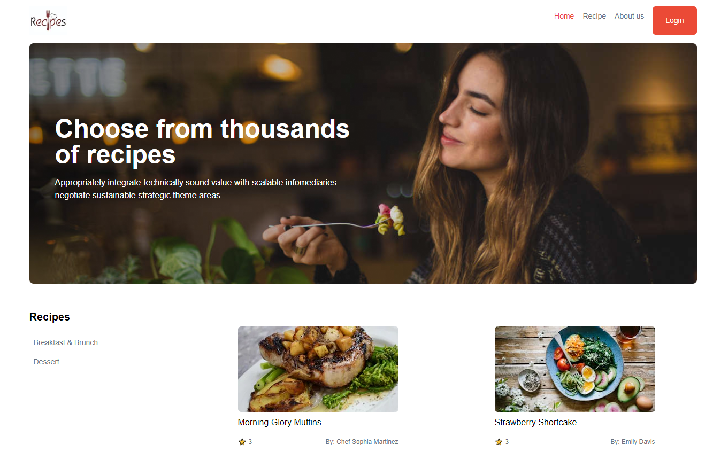
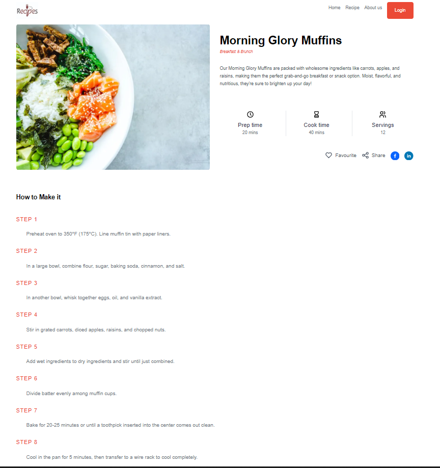
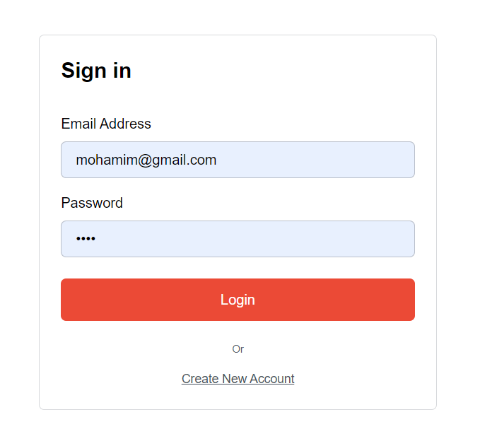
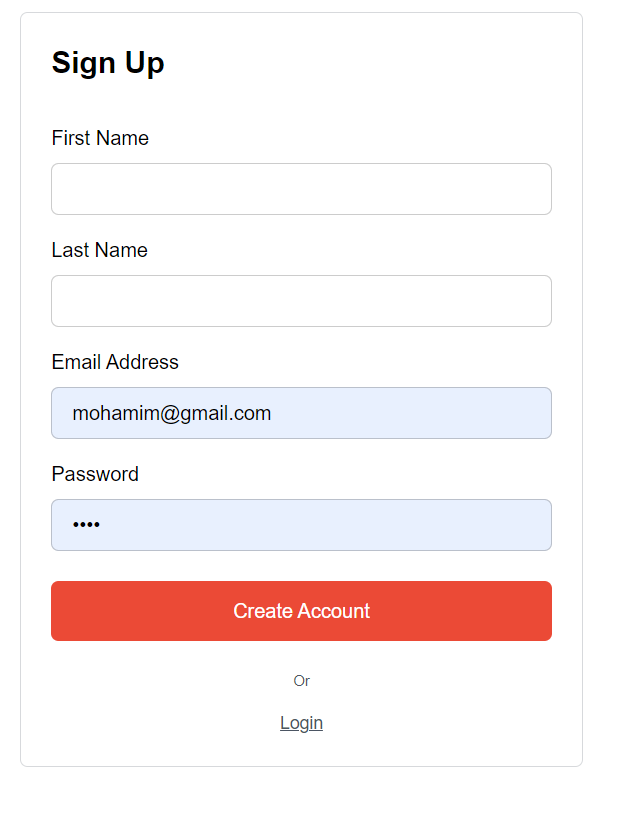
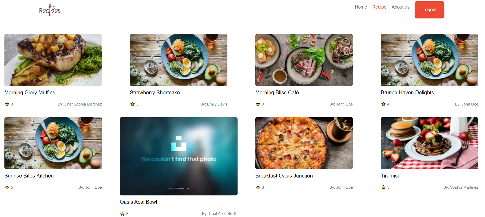
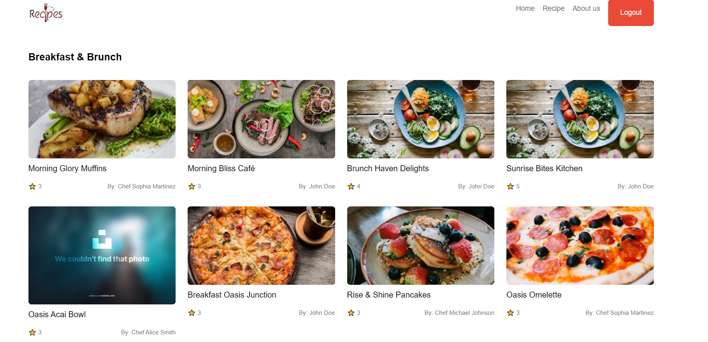

# KhanaKhazana Recipe Website

Welcome to KhanaKhazana, your go-to destination for exploring and sharing delicious recipes!

## Table of Contents
1. [Introduction](#introduction)
2. [Features](#features)
3. [Pages](#pages)
   - [Home Page](#home-page)
   - [Details Page](#details-page)
   - [Login and Register](#login-and-register)
   - [Recipe Page](#recipe-page)
   - [Category Page](#category-page)
4. [Getting Started](#getting-started)
5. [Technologies Used](#technologies-used)

## Introduction
KhanaKhazana is a recipe website designed to inspire cooking enthusiasts with a wide range of recipes from different cuisines. Whether you're a seasoned chef or a beginner, you'll find something to satisfy your culinary cravings.

## Features
- SEO-friendly home page with server-side rendering for optimal performance.
- User authentication system for secure login and registration.
- Detailed recipe cards with the ability to view recipe details.
- Categorized recipes for easy navigation and exploration.
- Favorite button to save recipes for logged-in users.
- Social media sharing functionality to share recipes with friends and family.
- Properly updated meta data for improved search engine visibility.

## Pages

### Home Page
The home page serves as the gateway to the world of recipes. It showcases featured recipes, popular categories. Users can easily navigate to different sections of the website from here.

### Details Page
The details page provides in-depth information about a specific recipe. Users can view ingredients, cooking instructions, and nutritional facts. Additionally, logged-in users can mark recipes as favorites for quick access later. The page also includes a share button to spread the joy of cooking on social media platforms.

 

### Login and Register
The login and register pages allow users to create an account or sign in to their existing account. This feature ensures personalized interactions and enables users to save their favorite recipes.

### Recipe Page
The recipe page displays a collection of recipes based on different categories such as breakfast, lunch, dinner, desserts, etc. Users can explore recipes within their preferred category and access recipe details with just a click.

### Category Page
The category page lists recipes belonging to a specific category. Users can browse through recipes in a particular category and discover new dishes to try out.

## Getting Started
To get started with KhanaKhazana, follow these steps:
1. Clone the repository to your local machine.
2. Install dependencies using `npm install`.
3. Set up MongoDB Atlas for database hosting.
5. Run the development server using `npm run dev`.
6. Access the website at `http://localhost:3000`.

## Technologies Used
- Next.js for server-side rendering and React components.
- MongoDB Atlas for database hosting and management.
- Node.js for server-side logic and API development.
- Tailwind CSS for styling and layout.
